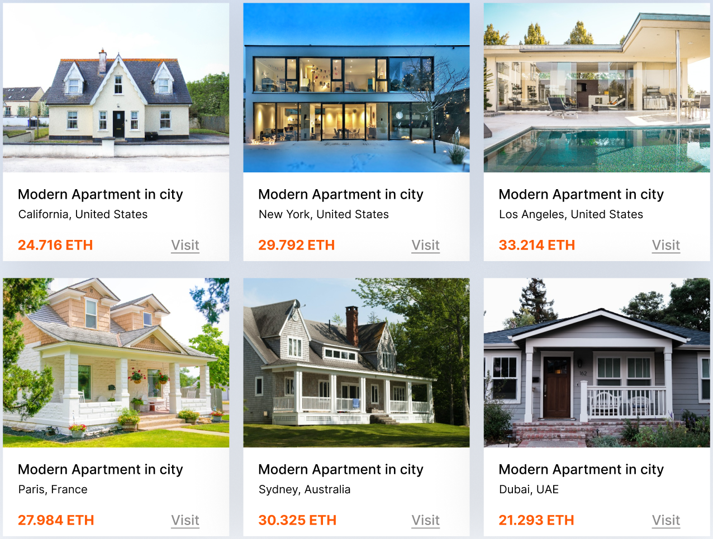

# 🏡 Real Estate Rental Platform

## 🌟 Overview

The Real Estate Rental Platform revolutionizes the property rental market by integrating cryptocurrency payments into a secure, scalable platform that simplifies transactions between property owners and tenants.

<div align="center">
  
</div>

## 💰 Cryptocurrency Payment System

A secure crypto payment system that allows users to pay rent or make deposits using cryptocurrencies. Our platform supports multiple cryptocurrencies, providing flexibility and security for all transactions.

<div align="center">
  
</div>

## ✨ Key Features

- **🏘️ Property Listings**: Browse through various types of properties (Cottage, Chalet, Manor, Penthouse, Farmhouse, Duplex)
- **💸 Crypto Payments**: Make secure payments using Ethereum and other cryptocurrencies
- **🔐 Secure Authentication**: Complete user registration and authentication system
- **👑 Admin Dashboard**: Comprehensive management tools for platform administrators
- **📱 Responsive Design**: Optimized experience across all devices

## 🔥 Web3 Integration

<div align="center">
  
</div>

Web3 is not a temporary trend - it is the future of the Internet! Our platform embraces decentralized technologies to provide:

- **Transparent Transactions**: All rental transactions are recorded on the blockchain
- **Smart Contracts**: Automated rental agreements and payments
- **Decentralized Identity**: Secure user authentication and verification

## 🚀 Getting Started

### Prerequisites

- Node.js (v18 or higher)
- npm or yarn

### Installation

1. **Clone the repository**
   ```bash
   git clone https://github.com/antonicstalent/Real-Estate-Rental-Platform
   ```

2. **Install dependencies**
   ```bash
   npm install
   ```

3. **Run the application**
   ```bash
   npm start
   ```
## 🌐 Web3 Features

- **Multi-Currency Crypto Payments**: Pay rent and deposits using ETH, USDC, DAI, and other major cryptocurrencies
- **Smart Contract Rental Agreements**: Legally binding rental agreements stored on the blockchain with automatic execution of terms
- **Decentralized Escrow System**: Security deposits held in smart contracts with transparent release conditions
- **Blockchain-Verified Property History**: Immutable record of property maintenance, previous tenants, and rental history
- **Tokenized Rental Rewards**: Earn tokens for on-time payments and property care, redeemable for discounts
- **Peer-to-Peer Property Bidding**: Transparent auction system for high-demand properties
- **Fractional Property Investment**: Purchase tokens representing partial ownership in premium properties
- **Decentralized Identity Verification**: KYC/AML compliance through blockchain-based identity solutions
- **Cross-Border Payments**: Instant international transactions without traditional banking delays or fees
- **Transparent Fee Structure**: All platform fees visible and verifiable on the blockchain
- **Immutable Reviews System**: Verified tenant and landlord reviews that cannot be altered or removed
- **Blockchain-Based Dispute Resolution**: Fair and transparent process for resolving disagreements

## 🔮 Future Roadmap

### Q3 2025
- **Multi-Chain Support**: Expand beyond Ethereum to Polygon, Binance Smart Chain, and Solana
- **Mobile App Launch**: Native iOS and Android applications with integrated crypto wallets
- **Enhanced Analytics Dashboard**: Blockchain-powered insights for property owners and investors

### Q4 2025
- **NFT Property Titles**: Tokenized property ownership certificates as NFTs
- **Metaverse Property Showings**: Virtual property tours in popular metaverse platforms
- **AI-Powered Price Predictions**: Machine learning models using on-chain data for market analysis

### Q1 2026
- **Decentralized Identity Integration**: Self-sovereign identity solutions for seamless verification
- **Cross-Chain Interoperability**: Seamless transactions across multiple blockchain networks
- **Smart Home Integration**: IoT devices connected to smart contracts for property access and monitoring

### Q2 2026
- **DAO Governance Implementation**: Community voting on platform development and fee structures
- **DeFi Lending Protocols**: Crypto-backed loans for security deposits and rent advances
- **Tokenized Real Estate Marketplace**: Secondary market for trading property tokens

### Long-Term Vision
- **Community-Owned Properties**: DAO-governed collective ownership of residential complexes
- **Decentralized Insurance Protocols**: Peer-to-peer coverage for both tenants and landlords
- **Real Estate Derivatives Market**: Advanced financial instruments for property investment
- **Global Property Index**: Blockchain-verified real estate valuation metrics
- **Carbon-Neutral Certification**: Tokenized proof of eco-friendly property management

---

<div align="center">
  <h3>🚀 Are you ready to enter the Web3 Era?</h3>
  <h4>Let's explore a decentralized world today!</h4>
</div>